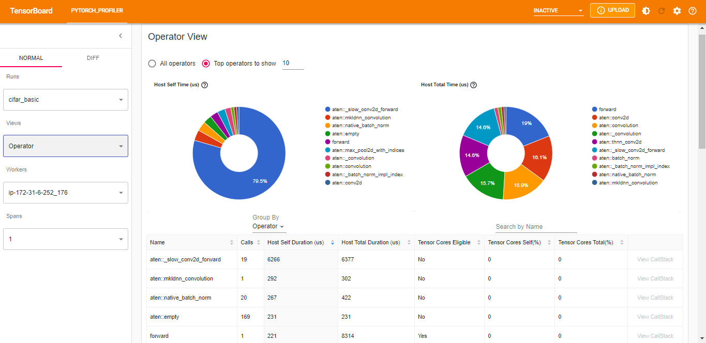
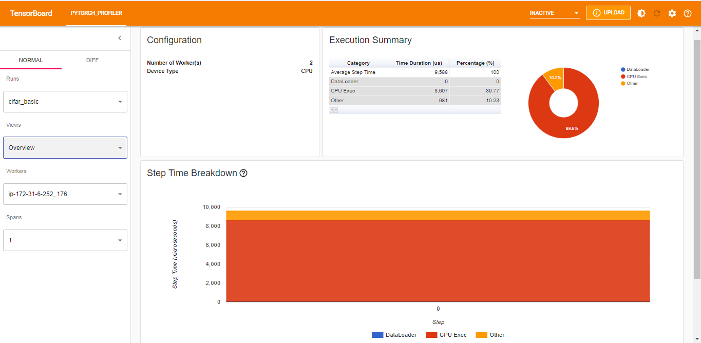
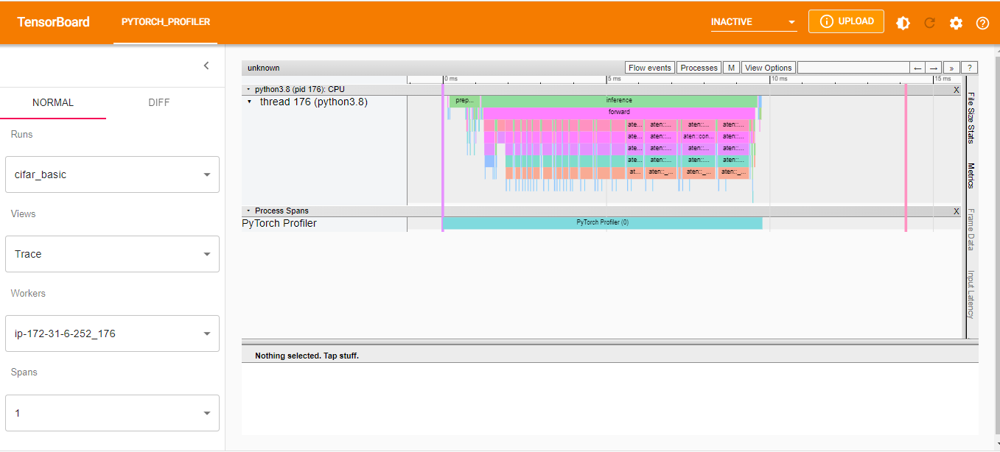
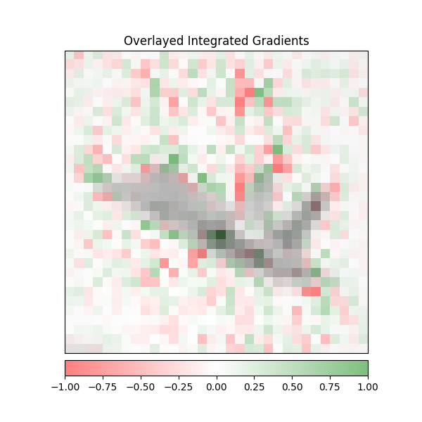

# Output of test
```bash

================================================ test session starts ================================================
platform linux -- Python 3.8.10, pytest-7.2.0, pluggy-1.0.0
rootdir: /home/ubuntu/TSAI-Assignment9-ModelServing, configfile: pyproject.toml
plugins: anyio-3.6.2, hydra-core-1.2.0
collected 1 item                                                                                                    

tests/test_torch_serve.py::TestFargateGradio::test_predict PASSED                                             [100%]

================================================= slowest durations =================================================
0.58s call     tests/test_torch_serve.py::TestFargateGradio::test_predict

(2 durations < 0.005s hidden.  Use -vv to show these durations.)
================================================= 1 passed in 0.65s =================================================


```
# PyTorch Profiler Screenshot
**Operator View**



**Overview**



**Trace View**



**Model Explanation Output**



**Inference of metrics API**
```bash
(aws_neuron_venv_pytorch) ubuntu@ip-172-31-6-252:~/TSAI-Assignment9-ModelServing$ curl http://127.0.0.1:8082/metrics
# HELP ts_queue_latency_microseconds Cumulative queue duration in microseconds
# TYPE ts_queue_latency_microseconds counter
ts_queue_latency_microseconds{uuid="3c57ee80-afcc-4f9a-ac58-98169b994077",model_name="cifar",model_version="default",} 5040.198000000001
# HELP ts_inference_latency_microseconds Cumulative inference duration in microseconds
# TYPE ts_inference_latency_microseconds counter
ts_inference_latency_microseconds{uuid="3c57ee80-afcc-4f9a-ac58-98169b994077",model_name="cifar",model_version="default",} 2142124.756
# HELP ts_inference_requests_total Total number of inference requests.
# TYPE ts_inference_requests_total counter
ts_inference_requests_total{uuid="3c57ee80-afcc-4f9a-ac58-98169b994077",model_name="cifar",model_version="default",} 24.0
```